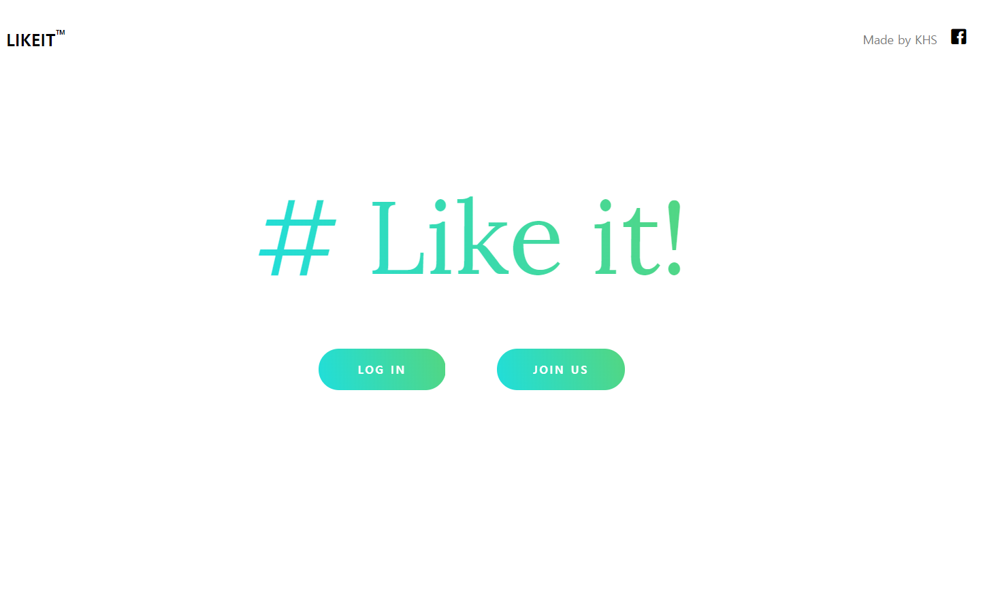
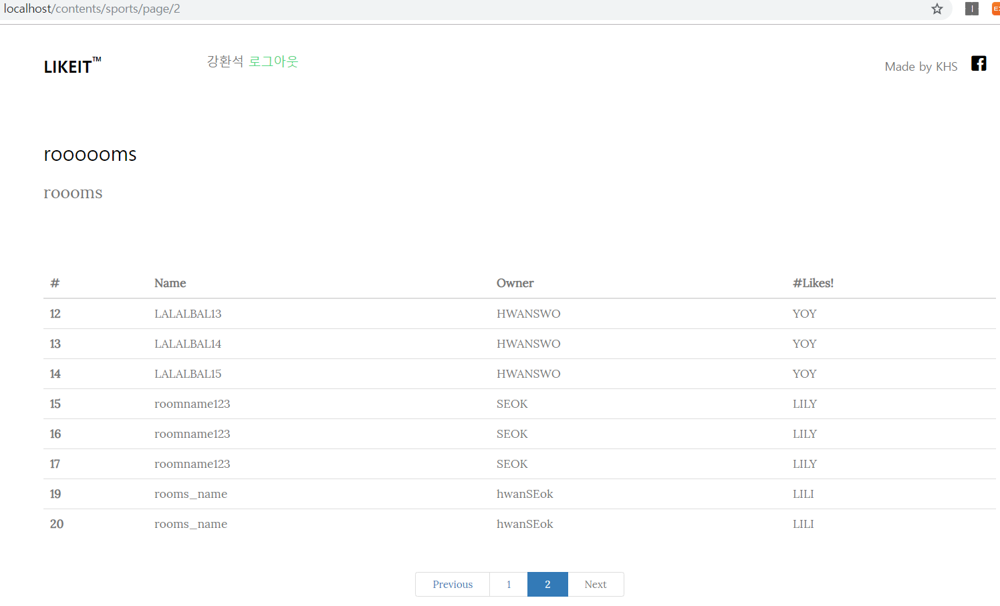
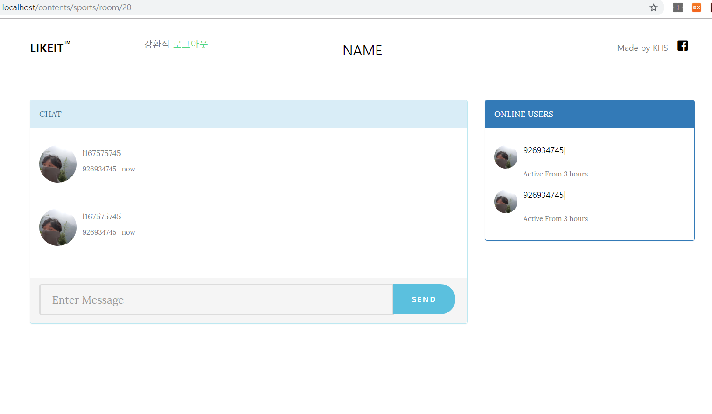

# -Like-it----Node_js
Socket.io를 이용한 관심분야 단체 채팅방 연결 서비스

# 서버([Node.js](https://nodejs.org/ko/))

### __구조__
    ### 서버사이드 렌더링으로 웹페이지 구현 
    1. app.js 에서 index.js 와 auth.js 로 라우팅 
    2. public 폴더에 css관련 파일 저장
    3. lib 폴더에 auth.check => 로그인 인증 확인 등 커스텀 모듈들 저장
    4. view 폴더에 실제 렌더링하는 ejs 파일들 존재
### __pages__

* 메인 : 

        1. 로그인이 필요 없으며 로그인 하면 메인 페이지가 바뀝니다.
                     
        2. 카테고리를 열람할 수 있으며 로그인된 사용자가 선택할경우 해당 관심분야들이 모여있는 방목록으로 이동합니다.
        
        

---
                  
* 관심분야 목록 :

        * 로그인할 경우 메인 화면에 표기되며 사진을 선택하면 관심분야 방목록으로 이동합니다.
        

        
---

* 관심분야 방목록 : 

        * 방 번호, 제목, 주인, 세부 관심사를 표기하며 각 행을 누르면 채팅방으로 입장합니다.
        

---

* 채팅방 :

        1. 채팅방에서 socket.io를 사용하여 실시간으로 관심분야가 같은 사람들끼리 채팅을 할 수 있습니다.

        2. 시간 순서대로 각 말풍선에 프로필사진, 내용, 보낸 시간, 보낸 사람이 표기됩니다.

        3. 오른쪽 사이드바에 해당 채팅방에 참여한 사람들의 프로필 사진과 이름이 표기됩니다.
        

---

## used ([__Socket.io__](https://socket.io/))

 ### __authentication__  

* 로그인 인증 : [passport.js](http://www.passportjs.org/) 

                -Local Strategy
                
                -KaKao Strategy (OAuth 2.0)
                
                -MYSQL Session Store
                
* socket.io 에서의 로그인 인증 : [passport.socketio module](https://www.npmjs.com/package/passport.socketio)
                
### __DataBase__ : [MYSQL](https://www.mysql.com/)

    Tables

        -auth_local
      
        -auth_kakao
      
        -sessions
      
        -rooms  //contains rooms' infomation
        
        -chat  //contains chating history
      
        -people //contains who is in room
        
      
---
